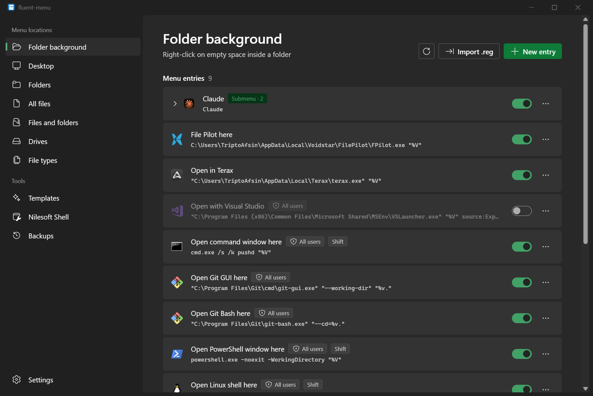
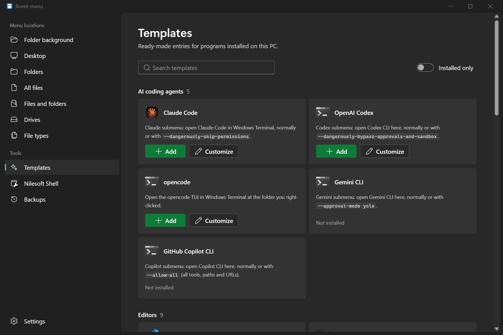
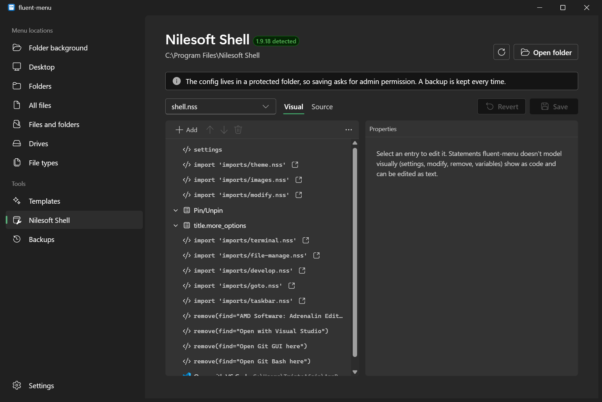

<p align="center">
  
</p>

<h1 align="center">Fluent Menu</h1>

<p align="center">
  A Windows 11 style manager for the Explorer right-click menu.<br>
  Create, edit, hide and remove context menu entries without touching <code>regedit</code>, and edit Nilesoft Shell menus visually.
</p>

<p align="center">
  <a href="https://github.com/TriptoAfsin/fluent-menu/releases/latest">Download</a>
</p>



<table>
  <tr>
    <td></td>
    <td></td>
  </tr>
  <tr>
    <td align="center">Templates</td>
    <td align="center">Nilesoft Shell editor</td>
  </tr>
</table>

## Features

- **Every menu location.** Folder background, desktop, folders, all files, files and folders, drives, and individual file types (`.txt`, `.png`, ...).
- **Create entries and submenus.** Pick a title, icon and command. One click wraps a command so it opens in Windows Terminal at the folder you right-clicked.
- **Hide without deleting.** Turning an entry off uses Windows' own `LegacyDisable` flag, so turning it back on restores it exactly.
- **Shell extensions.** Turn COM context menu handlers (7-Zip, Git, etc.) on and off.
- **Templates.** 25 ready-made entries for programs found on your PC, with search and an installed-only filter:
  - **AI coding agents:** Claude Code, OpenAI Codex, Gemini CLI and GitHub Copilot CLI. Each one is a submenu with a normal launch plus its no-prompts mode. There's also opencode.
  - **Editors:** VS Code, VS Code Insiders, Cursor, Windsurf, Kiro, Antigravity, Zed, Sublime Text and Notepad++.
  - **Terminals and shells:** Windows Terminal, PowerShell 7, Windows PowerShell, Command Prompt, WSL, Git Bash, WezTerm and Alacritty.
  - **Git and file tools:** lazygit, GitHub Desktop and Yazi.
- **Nilesoft Shell editor.** When [Nilesoft Shell](https://nilesoft.org) is installed, Fluent Menu detects it and lets you edit `shell.nss` and its imports as a tree. You can add, edit, move and delete items, menus and separators. Anything it doesn't model visually (settings, `modify`, `remove`, variables) is kept byte for byte and can be edited as text. There's also a Source view.
- **Backups.** Every edit, delete and Nilesoft save is backed up first, and you can restore from the Backups page.
- **Import and export `.reg` files.**
- **Admin only when needed.** Entries for just you need no admin rights. Changing all-users entries prompts once, or you can restart as administrator.
- Native Windows 11 look: Mica, your accent color, light and dark themes.

## Install

Download from [Releases](https://github.com/TriptoAfsin/fluent-menu/releases/latest):

| File | What it is |
| --- | --- |
| `Fluent-Menu_<version>_x64-setup.exe` | Installer. Installs for the current user, adds a Start menu entry and an uninstaller. |
| `Fluent-Menu_<version>_x64-portable.exe` | Portable. A single exe you can run from anywhere. |

Both need the WebView2 runtime, which ships with Windows 11 and up-to-date Windows 10.

## How it works

- Registry changes are written as `.reg` text and applied with `reg.exe import`. Machine-wide changes (`HKLM`) run `reg.exe` elevated through UAC. Per-user entries go to `HKCU\Software\Classes`.
- Before an entry is edited or deleted, its key is exported to `%APPDATA%\fluent-menu\backups\registry`.
- Nilesoft files are parsed by a lossless parser (`src/nss/parser.ts`) that keeps the exact source text of every node, so saving an unchanged file writes back identical bytes. Saving into `Program Files` uses an elevated copy, and the previous version goes to `%APPDATA%\fluent-menu\backups\nilesoft`.

## Development

Requires Node 22+, pnpm 10, and the Rust stable toolchain (MSVC).

```sh
pnpm install
pnpm tauri dev       # run the app
pnpm test            # parser tests
cd src-tauri && cargo test
pnpm tauri build     # installer in src-tauri/target/release/bundle/nsis
```

## Releasing

Bump `version` in `package.json`, `src-tauri/tauri.conf.json` and `src-tauri/Cargo.toml`, then push a tag:

```sh
git tag v0.2.0
git push origin v0.2.0
```

The Release workflow builds the installer and the portable exe and publishes them as a GitHub release.

## License

MIT
